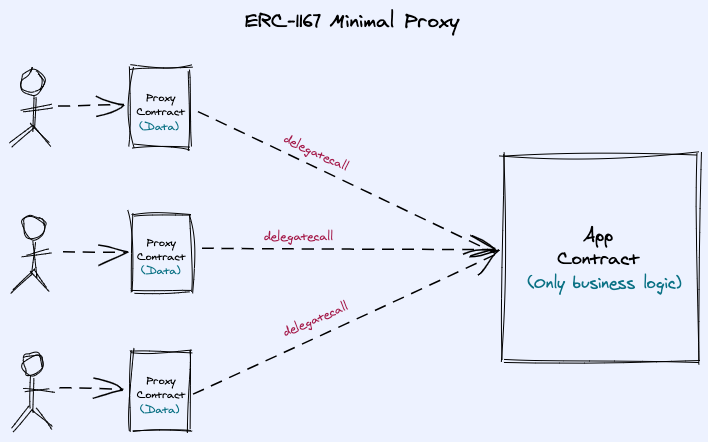

# ERC-1167: Minimal Proxy Contract Example

An example of a contract that implements ERC-1167: Minimal Proxy

### Video Tutorial

There is an accompanying video tutorial that explains these concepts in more detail over on the [DevBootstrap YouTube channel here](https://youtu.be/7H7GVI1gsTc).

### ERC-1167 Concepts



__Setup commands__

For background information, these are the commands used to setup this project initially

```
npm i -g truffle
npm install @openzeppelin/upgrades
truffle init
```

__Try out this example__

To run this example on your local machine, you need to clone this repo(!) and then follow the below instructions.

Start up a new `ganache-cli` session in one termain and a truffle console session in another terminal using `truffle console` then, in the session, compile and deploy the Store and StoreFactory contracts. In order to test this out in the Tuffle Console we essentially need to:

1. Compile the contracts
1. Migrate the contracts
1. Get an instance of the StoreFactory
1. Verify the `impl` address for the implemtation of the Store Contract has been set correctly
1. Check the deployed contract addresses using the `networks` command
1. Now for the fun stuff! Lets clone the Store implementation using the StoreFactory contract.
1. Fetch the result of the `ProxyCreated` event. This event is defined in the [OpenZeppelin ProxyFactory](https://github.com/OpenZeppelin/openzeppelin-sdk/blob/master/packages/lib/contracts/upgradeability/ProxyFactory.sol) contract that we are using here. Its fired any time we call the `deployMinimal` of the `ProxyFactory` and it includes one property: __proxy__ which is the address of the new cloned proxy contract.
1. Get an instance of the proxy contract from the proxy address returned in the `ProxyCreated` event.
1. Check the value of the store (it should be empty)
1. Set the value of the store to something
1. Check the value of the store again (it should be set to the new value)
1. Now clone 2 more proxy contracts
1. Repeat the above and set the value to different strings in each proxy contract
1. Confirm all the value data strings are different and set correctly!

```
compile
migrate --reset
sf = await StoreFactory.deployed()
sf.impl() // This should be the same address as the deployed Store contract!
networks // Lets verify the contract deployed addresses
sf.cloneStore() // This returns the transaction receipt
sf.getPastEvents('ProxyCreated') // This will return the event that contains the address of the cloned contract instance
store1 = await Store.at('0x4644f030a4713387d9D02d1662Fb4e1a9A385dcb') // use the address in the returnValues 'proxy' of the ProxyCreated event
store1.value() // returns ''
store1.setValue('My First Store')
store1.value() // returns 'My First Store'

// Lets create two more store proxies!

sf.cloneStore()
sf.cloneStore()

sf.getPastEvents('ProxyCreated', {fromBlock: 0})

store2 = await Store.at('0xE872f5BEaEAfA067Eba935f20f08F84F928354C5')
store3 = await Store.at('0x8871Ba7F9002287c4A40c2cce036daB7a57D2742')

store2.setValue('My Second store')
store3.setValue('My Third store')

// Confirm all values are set as expected!
store1.value() // returns 'My First Store'
store2.value() // returns 'My Second Store'
store3.value() // returns 'My Third Store'
```

Versions used:

```
Truffle v5.1.32 (core: 5.1.32)
Solidity v0.5.16 (solc-js)
Node v12.18.1
Web3.js v1.2.1
```